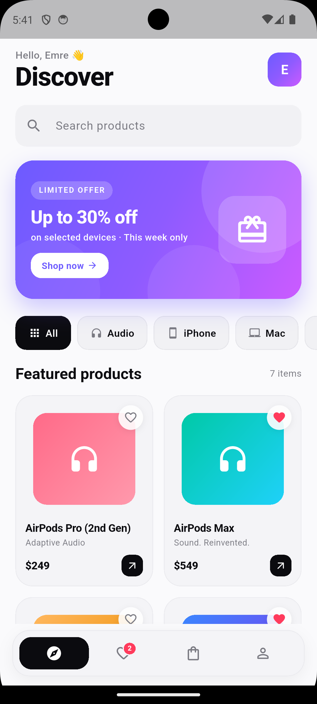
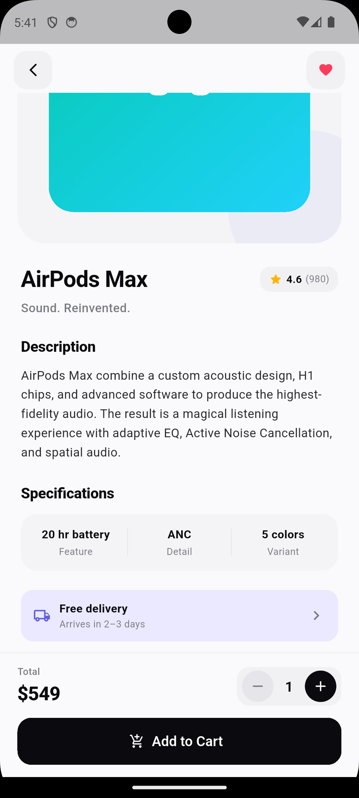
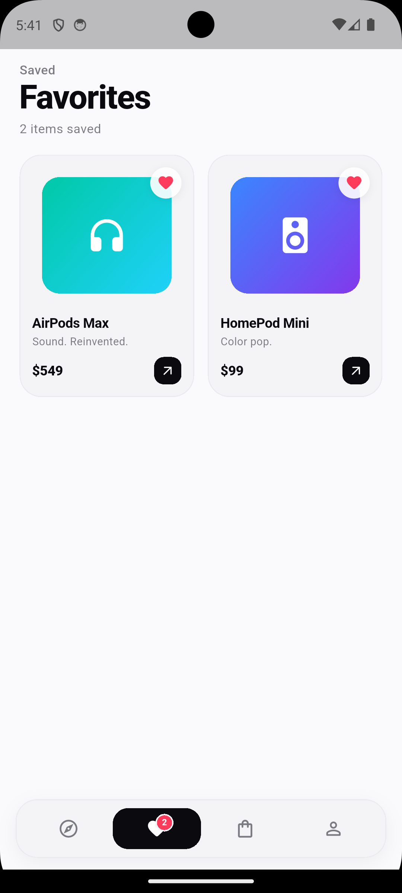
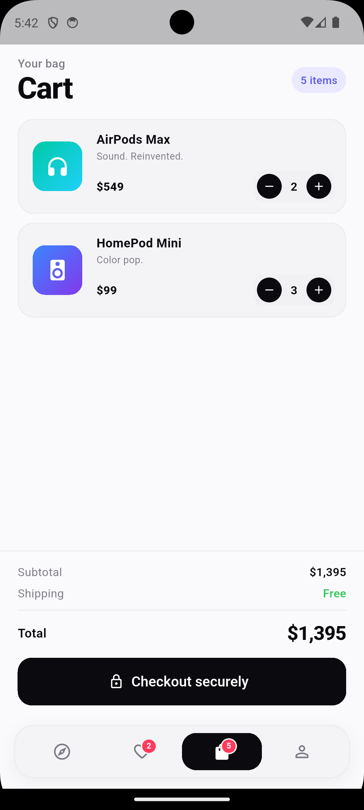
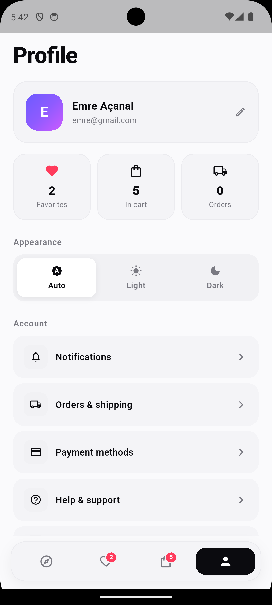

# Mini Katalog Uygulaması

Flutter haftalık eğitim projesi — temel widget'lar, sayfa geçişleri, veri modeli ve klasör yapısı pratiğine dayanan, çalışır bir mobil katalog uygulaması.

## Kısa Açıklama

"Mini Katalog Uygulaması", bir ürün listesini grid görünümünde sunan; arama, kategori filtreleme, ürün detayı, sepete ekleme ve favoriler gibi temel e‑ticaret akışlarını içeren bir Flutter projesidir. Eğitim hedeflerine birebir paralel olarak `Stateless / Stateful` widget'lar, `Navigator.push / pop` ile sayfa geçişleri, `MaterialPageRoute` üzerinden argüman taşıma, `fromJson / toJson` ile model parse, `ListView.builder` / `GridView` ile listeleme ve `ChangeNotifier` ile basit state güncelleme örneklerini barındırır.

### Ana Özellikler

- **Discover ekranı** — Selamlama başlığı, arama kutusu, promosyon banner'ı, kategori chip filtreleri ve 2 kolonlu `GridView`.
- **Favorites ekranı** — Kalp ikonuyla kaydedilen ürünlerin grid görünümü ve boş durum tasarımı.
- **Cart ekranı** — Adet artır/azalt, sola kaydırarak silme (`Dismissible`), summary + checkout butonu ve sipariş onay diyaloğu.
- **Profile ekranı** — Profil kartı, favori/sepet/sipariş istatistikleri, tema seçici (Auto / Light / Dark) ve ayarlar listesi.
- **Ürün detayı** — `Hero` animasyonlu büyük görsel, rating badge'i, açıklama, teknik özellikler, teslimat bilgisi, adet seçici ve "Add to Cart" butonu.
- **Bottom navigation bar** — Discover · Favorites · Cart · Profile sekmeleri; seçili sekmede etiket görünür, sepet ve favoride canlı badge sayısı.
- **Light & Dark mode** — Tüm ekranlar her iki temada da çalışır; "Auto" cihazın sistem temasına uyar.
- **Akıllı görsel placeholder** — Asset eklenmediği durumda ürün ID'sine göre deterministik gradient ve ürüne uygun ikon (AirPods → kulaklık, iPhone → telefon, MacBook → laptop vb.) ile profesyonel görünüm.

## Kullanılan Flutter Sürümü

Bu proje aşağıdaki sürümler ile geliştirilmiş ve test edilmiştir:

- **Flutter:** `3.41.9` (stable channel)
- **Dart SDK:** `>=3.3.0 <4.0.0`
- **Material 3:** `useMaterial3: true`

Yönergedeki "Ekstra paket kullanımı yapılmayacaktır" kuralına uygun olarak yalnızca standart `material.dart` kütüphanesi ve Flutter'ın default `cupertino_icons` paketi kullanılmıştır.

## Çalıştırma Adımları

1. Flutter SDK'sının kurulu olduğundan emin olun:
   ```bash
   flutter --version
   ```
2. Projeyi klonlayın:
   ```bash
   git clone https://github.com/Radowfen/mini_catalog.git
   cd mini_catalog
   ```
3. Bağımlılıkları indirin:
   ```bash
   flutter pub get
   ```
4. Bir emülatör (Android Studio AVD) veya fiziksel cihazın bağlı olduğunu doğrulayın:
   ```bash
   flutter devices
   ```
5. Uygulamayı çalıştırın:
   ```bash
   flutter run
   ```

Testleri çalıştırmak için:
```bash
flutter test
```

Kod kalitesini kontrol etmek için:
```bash
flutter analyze
```

## Proje Yapısı

```
lib/
├── main.dart                       # Uygulama giriş noktası; tema, cart, favorites root state
├── models/
│   ├── product.dart                # Ürün modeli (fromJson / toJson, rating, reviewCount, tag)
│   ├── cart.dart                   # Sepet state (ChangeNotifier) + quantity +/- işlemleri
│   └── favorites.dart              # Favoriler state (ChangeNotifier)
├── data/
│   └── product_repository.dart     # JSON simülasyonu, arama, kategori filtresi
├── screens/
│   ├── main_shell.dart             # Bottom navigation bar'lı iskelet
│   ├── discover_screen.dart        # Ana liste + kategori chip'leri + arama
│   ├── favorites_screen.dart       # Favori ürünler grid
│   ├── product_detail_screen.dart  # Ürün detayı + adet seçici
│   ├── cart_screen.dart            # Sepet + swipe-to-dismiss + checkout
│   └── profile_screen.dart         # Profil + tema seçici + ayarlar
├── widgets/
│   ├── product_card.dart           # GridView için ürün kartı + favori butonu
│   ├── product_image.dart          # Image.asset + gradient placeholder fallback
│   ├── gift_store_banner.dart      # Promosyon banner'ı
│   ├── category_chips.dart         # Kategori filtre chip'leri
│   └── quantity_selector.dart      # − N + adet seçici
└── theme/
    ├── app_theme.dart              # Light + Dark renk paleti ve tema
    └── theme_mode_notifier.dart    # Tema modu (system/light/dark)
```

## Eğitim Hedeflerinin Karşılığı

| Gün | Hedef | Projede karşılığı |
|---|---|---|
| 1 | Stateless / Stateful widget mantığı | `MiniCatalogApp`, `MainShell`, `DiscoverScreen` (Stateful); `ProductCard`, `GiftStoreBanner` (Stateless) |
| 2 | Temel widget'lar (Container, Row, Column, Card, ListTile) | `cart_screen.dart`, `product_card.dart`, `profile_screen.dart` |
| 3 | Navigator.push / pop, MaterialPageRoute, Route Arguments | `discover_screen.dart`'taki `_openDetail`; `favorites_screen.dart`'taki detay açma |
| 4 | fromJson / toJson, ListView.builder, arama / filtreleme | `product.dart`, `product_repository.dart`, `cart_screen.dart` (ListView.separated) |
| 5 | GridView ürün kartları, detay sayfası, sepet simülasyonu | `discover_screen.dart` GridView, `product_detail_screen.dart`, `cart.dart` (adet +/-) |

## Ekran Görüntüleri

Aşağıdaki görüntüler Android emülatöründe (Pixel) alınmıştır:

| Discover | Ürün Detayı | Favoriler |
|---|---|---|
|  |  |  |

| Sepet | Profil |
|---|---|
|  |  |

## Veri Kaynağı

Eğitim yönergesinde belirtilen `wantapi.com/products.php` ve alternatif `fakestoreapi.com`, `dummyjson.com` adresleri yerine ürün verileri proje içinde **JSON formatında mock veri** olarak `lib/data/product_repository.dart` içinde saklanır ve `Product.fromJson` ile parse edilir. Bu yaklaşım gerçek bir API yanıtını birebir taklit eder ve eğitim hedefi olan "JSON mantığı ve model sınıfı oluşturma"yı doğrudan karşılar. İleride `http` paketi eklenerek aynı parse mantığı gerçek bir API'ye bağlanabilir.

## Geliştirici

**Emre Açanal** — Flutter Eğitim Stajı, 2026.
